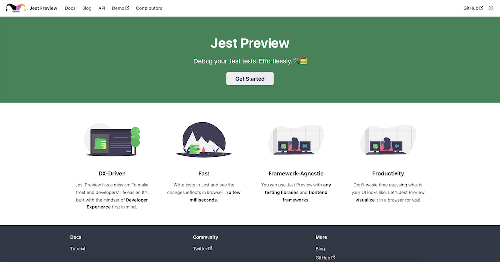

Hello everyone. It's been 17 days from the first version of [Jest Preview](https://www.npmjs.com/package/jest-preview). We have worked hard to make Jest Preview a great library to support frontend engineers writing and debugging tests in Jest. We completed the implementation to support:

- 👀 Preview your actual app's HTML in a browser in milliseconds.
- 🔄 Auto reload browser when execute `preview.debug()`.
- 💅 Support CSS:
  - ✅ [Direct CSS import](#3-configure-jests-transform-to-intercept-css-and-files)
  - ✅ [Styled-components](https://styled-components.com/)
  - ✅ [External CSS](#4-optional-configure-external-css)
  - ✅ [CSS Modules](https://github.com/css-modules/css-modules)
- 🌄 Support viewing images.

We're also working on [Sass](https://sass-lang.com/) and plan to release it in a couple of days.

Jest Preview wants to be a "just work" library, it means users can just run `npm install --save-dev jest-preview` and use it right away. However, to view the actual app's UI in a browser, we need to configure it a bit. We did write some instructions in [README.md](https://github.com/nvh95/jest-preview/blob/main/README.md). But with the growing of project complexity and demands of adding new features, we decided to build a dedicated documentation site for [Jest Preview](https://www.npmjs.com/package/jest-preview). We are happy to announce that you can now access the documentation at [www.jest-preview.com](https://www.jest-preview.com).

We will try to document it as detailed as possible, but we will also try to keep it simple for developers know Jest Preview for the first time. Advanced users can configure their own configuration to adapt to special use cases, new comers can just quickly install Jest Preview and get benefits from it.

The documentation is still very new, we will work to make it clear and concise as much as possible. We also appreciate your helps to improve the documentation such as keep it up-to-date, fixing the typo, paraphrase parts are not clear. Please feel free to [open an issue](https://github.com/nvh95/jest-preview/issues) or [pull request](https://github.com/nvh95/jest-preview/pulls) to report any unclear parts and suggest improvements to documentation.

Thank you for your support and happy coding!
