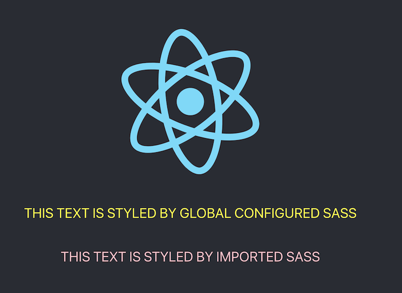

Another day, another feature added to [Jest Preview](https://www.npmjs.com/package/jest-preview). Today, we're adding support for [Sass](https://sass-lang.com/), thanks to the [awesome work](https://github.com/nvh95/jest-preview/pull/52) from [Truong Nguyen](https://github.com/ntt261298).

Sass is one of the most popular CSS extension language in the ecosystem and is being used widely. From version [0.1.5](https://github.com/nvh95/jest-preview/releases/tag/v0.1.5), style written in Sass will be displayed in Jest Preview Dashboard.



You can even add Sass as an external CSS via [jestPreviewConfigure](/docs/api/jestPreviewConfigure). This is usually handy for stylesheet files imported in `src/index.js` or `src/main.js`.

```js
// setupTests.js
import { jestPreviewConfigure } from 'jest-preview';

// Should be path from root of your project
jestPreviewConfigure({
  // Configure external CSS
  externalCss: [
    'demo/global.scss',
    'node_modules/@your-design-system/css/dist/index.min.scss', // scss from node_modules
  ],
});
```

For now, Jest Preview only supports Dart Sass, since [LibSass and Node Sass are deprecated](https://sass-lang.com/blog/libsass-is-deprecated). One caveat is that Jest Preview doesn't support [load path](https://sass-lang.com/documentation/cli/dart-sass#load-path) yet. We will add it to the next version.

We hope with the support of Sass, Jest Preview can cover more use cases and be more useful for front end engineers to write tests. If you have any questions, please reach us at [Discussion](https://github.com/nvh95/jest-preview/discussions).

Happy jesting!
