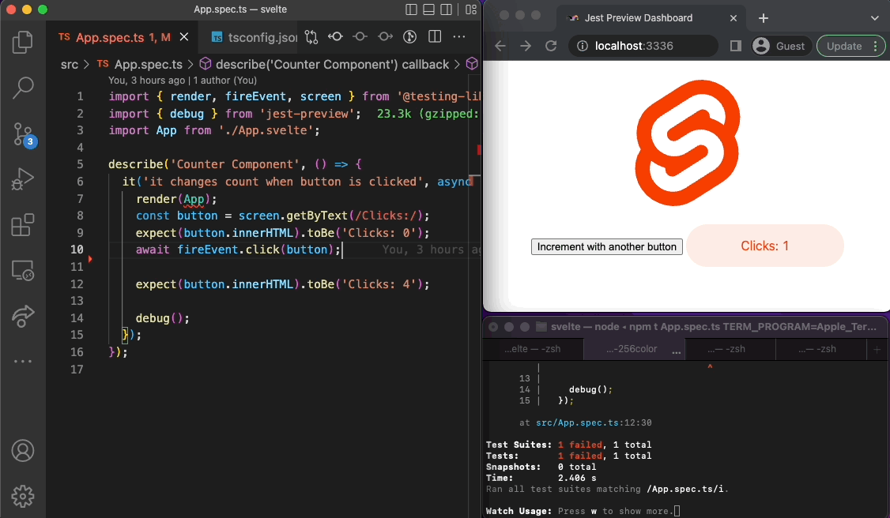

[jest-preview](https://www.npmjs.com/package/jest-preview) is initially designed to work with jest, react and react-testing-library. However, the package is framework-agnostic, and you can use it with any testing libraries. Today, we add [an example](https://github.com/nvh95/jest-preview/tree/main/examples/svelte) of using it with [**Svelte**](https://svelte.dev) and [**Svelte Testing Library**](https://testing-library.com/docs/svelte-testing-library/intro/)

<!--truncate-->



Now, you can easily preview your UI in Jest when using Svelte just by 2 steps:

1. Open Jest Preview Dashboard:

```bash
jest-preview
```

2. Add `debug()` to wherever you want to preview:

```diff
import { render, fireEvent, screen } from '@testing-library/svelte';
import { debug } from 'jest-preview';
import App from '../../App.svelte';

describe('Counter Component', () => {
  it('it changes count when button is clicked', async () => {
    render(App);
    const button = screen.getByText(/Clicks:/);
    expect(button.innerHTML).toBe('Clicks: 0');
    await fireEvent.click(button);
    expect(button.innerHTML).toBe('Clicks: 1');

+    debug();
  });
});
```

That's it. You can see the full example and detailed instruction at https://github.com/nvh95/jest-preview/tree/main/examples/svelte.

<!-- TODO: After copying README.md to docs page, update the link here. -->
